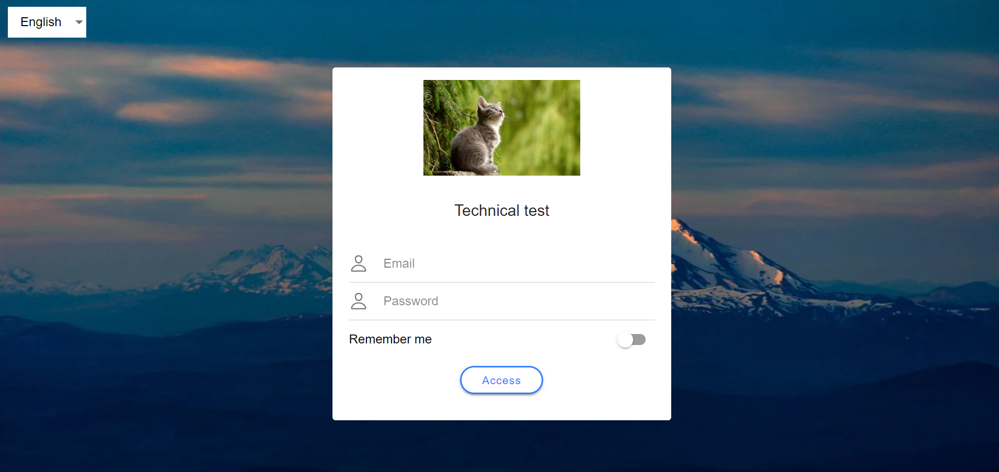

# prueba-tecnica-sanitas

> Responsive login page application developed with Angular and Ionic.

## Table of Contents

- [General Info](#general-information)
- [Technologies](#technologies)
- [Features](#features)
- [Setup](#setup)
- [Usage](#usage)
- [Project Status](#project-status)
- [TODO](#todo)
- [Contact](#contact)

## General Information

This project consists of a one page login form application with responsive design, built for learning purposes. It implements input validation and switching language
capabilities between english and spanish. The purpose of this project is to learn more about Ionic and its implementation with Angular, as well as honing
SASS styling and testing techniques in a fully operational frontend environment.

## Technologies

- Angular - version 14.0.0
- Ionic - version 6.1.15
- SASS - version 1.53.0
- Jasmine - version 3.8.0
- Karma - version 6.3.2

## Features

- Input validation for both email and password, which ensures that the data being introduced is adequate in the context of a login page.
- Responsive design with a breakpoint at 960 px, with two different form styles for mobile and desktop.
- Switching language option, allowing for two different langugages to choose from: english and spanish.

## Setup

In order for the project to run, Ionic must be installed in the machine. Please refer to the [Oficial documentation](https://ionicframework.com/docs/intro/cli)
and follow the steps detailed there. With Ionic installed, just clone the repository and install the dependencies using `npm install`. Then, run the project using
`ionic serve`. The application runs on port 8100 by default.

## Usage

The application is really easy to use. Just type a valid email address and a password with at least 5 characters, and press "Access". If the data introduced
passes the validations, an 'OK' message will appear on the console. In case any validation is failing, an error message will appear below the
corresponding form field. Language switching is available from the button located on the top-left part of the screen.

## Project Status

Project is: _in progress_.

## TODO

- Add functionality to preserve the login details when re-entering the page after filling in the form with the "Remember Me" option checked.
- Add another page to access after succesfully logging in.
- Add authentication guard to secure the aforementioned page from being accessed directly without using the login.
- Add more language support.

## Contact

Feel free to contact me using the following email address: alvaromomblanmedina@gmail.com
